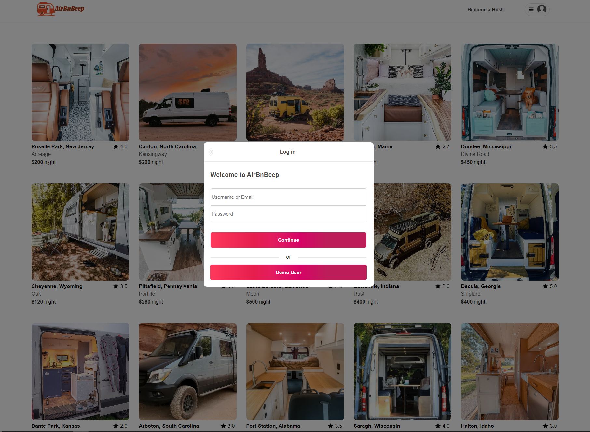
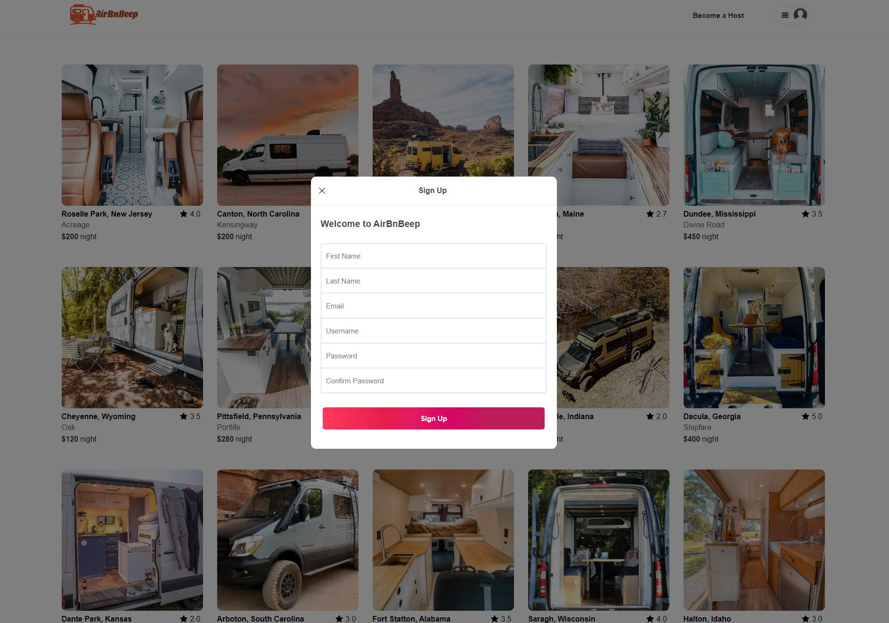
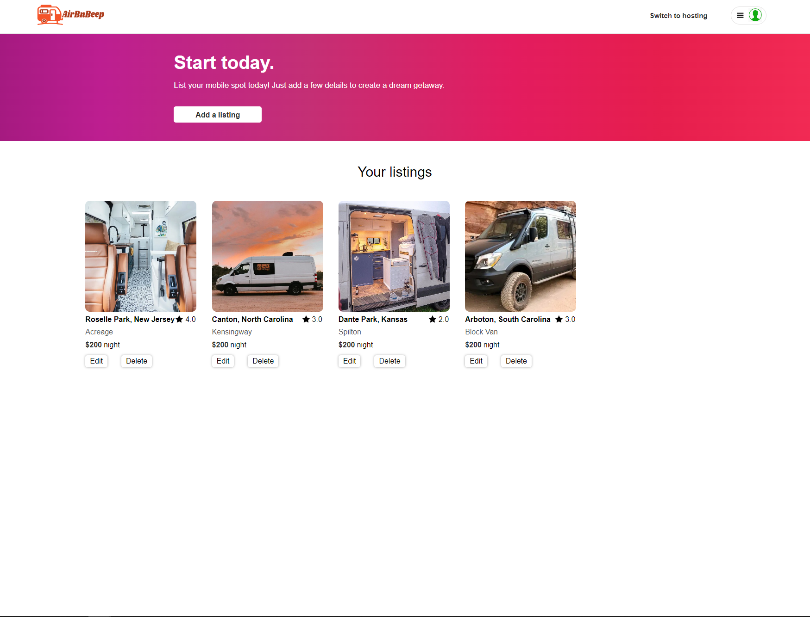
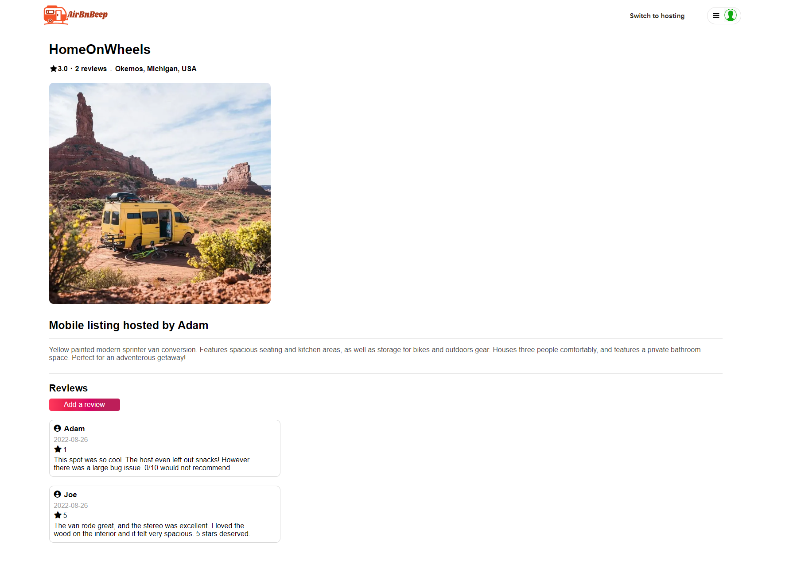

# AirBnBeep

## About AirBnBeep

AirBnBeep is a web application designed to mimic AirBnb. It is a home for mobile vacation spots, such as RVs, Airstreams, sprinter-van conversions, and more! Users can checkout spots as well as host their own. After clicking on a spot that a user is interested in, they can look at reviews, leave their own, and also book a spot for their travels. There is also a search feature in the navigation bar to allow users to find spots based on their names. Check out the live site here: https://airbnbeep.herokuapp.com/

Below are the links to the project wiki pages:

* https://github.com/benwaldee/AirBnBeep/wiki/API-Routes
* https://github.com/benwaldee/AirBnBeep/wiki/Database-Schema
* https://github.com/benwaldee/AirBnBeep/wiki/Features
* https://github.com/benwaldee/AirBnBeep/wiki/Redux-State-Shape

This project is built with:
* JavaScript
* PostgreSQL
* Sequelize
* Express
* React
* Redux

## Features:

### User Authentication

* Login Modal

* Signup Modal

### Spots

* Home page

* Hosting page

### Reviews

* Spot detail page (with reviews)

## How to run locally:

1. Click the green "Code" button on the main page.
2. If you do not have SSH set up, copy the initial link (click the two squares on the right of it).
3. If you do have SSH set up, switch to the SSH tab and copy that link.
4. Once copied, open your terminal.
5. Navigate to the folder where you would like the local repo to exist.
6. Enter the command: git clone --paste your link here--
8. Cd into the backend folder and run "npx dotenv sequelize db:migrate" to add migrations.
9. Then run "npx dotenv sequelize db:seed:all" to add seed data.
10. Create a .env file in your backend folder and create and add your own values to these variables: PORT, DB_FILE (location of the database), JWT_SECRET, and JWT_EXPIRES_IN
11. Run the command "npm i" to install dependencies.
12. cd into the backend folder in a new terminal and run "npm start" to start the backend server.
13. cd into the frontend folder in a new terminal and run "npm start" to start the frontend server.
14. Congratulations! The website should open on local host in your browser.

NOTES:
* Chrome works best.
* Make sure you do not have anything running on the the same local ports.
